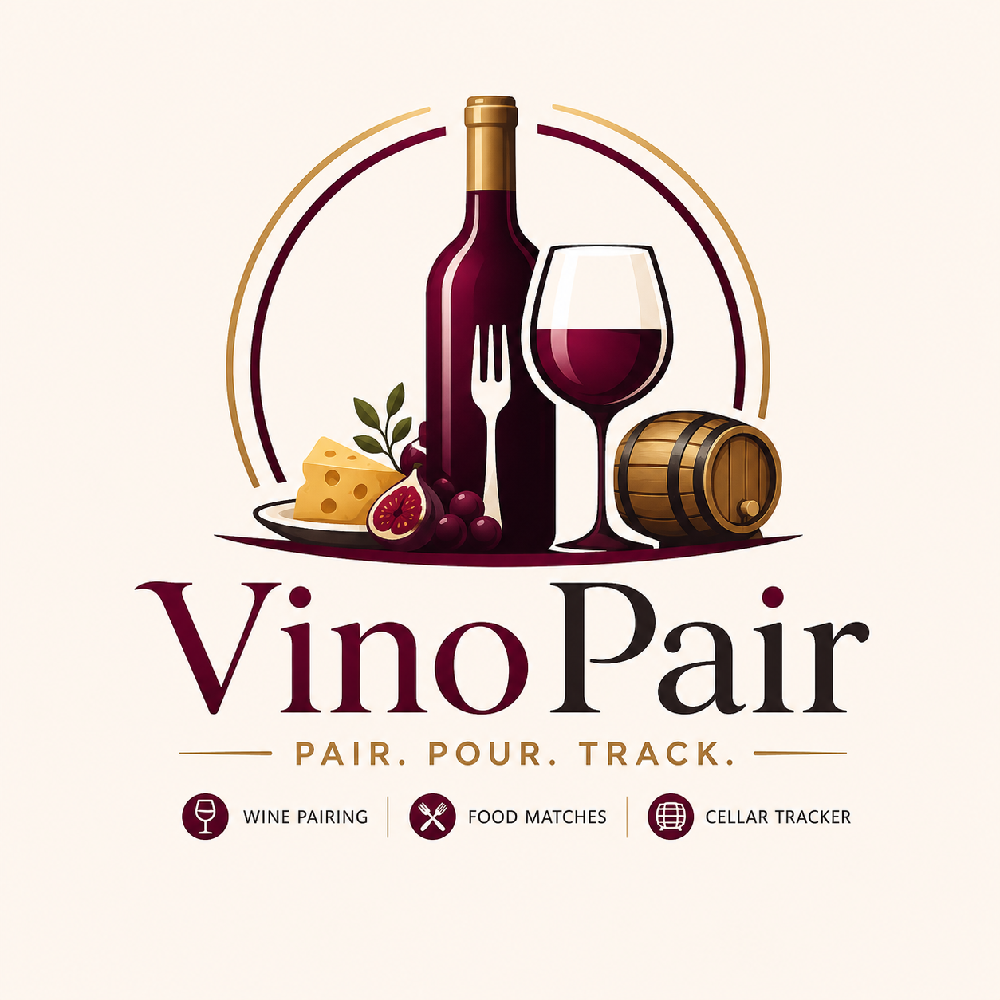

# VinoPair



**Pair. Pour. Track.**

VinoPair is a mobile-first wine and food pairing assistant. Describe a meal, upload a menu or recipe, or start from a bottle you want to open. VinoPair turns flavor, occasion, and cellar context into confident pairing recommendations.

The cellar tracking component is called **inVINtory**.

## Product Direction

VinoPair is a standalone wine application focused on:

- Meal-first wine pairing
- Wine-first food pairing
- Personal cellar tracking through inVINtory
- Source-backed wine enrichment
- Plain-English sommelier reasoning
- Visual pairing intelligence that feels polished and marketable

## Current App

- Meal input for dinner descriptions, recipe URLs, recipe files, and menu-image uploads.
- Wine-first pairing that starts from a cellar bottle or typed wine.
- Occasion modes: Classic, Weeknight, Dinner Party, Date Night, and Takeout.
- Graphical pairing views with a balance compass, flavor constellation, wine profile cards, and food pairing tiles.
- Live meal profiling for cuisine, richness, acidity, spice, sweetness, dominant flavors, and pairing risks.
- Preference controls for wine style, philosophy, flavor profile, budget, and avoid notes.
- **inVINtory** cellar tracking with local persistence, search, style filtering, quantity controls, removal, quick-add inference, source-backed enrichment, barcode lookup, and AI-assisted label photo scans.
- Wine-service verification links for scanned labels and manual adds, including Vivino, Wine-Searcher, and CellarTracker search handoff.
- Open Food Facts barcode lookup for public product records.
- Pairing results with best cellar match, ideal bottle to buy, confidence, alternatives, occasion rationale, and wines to avoid.
- Inverse pairing results with ideal dishes, weeknight options, foods to avoid, and serving notes for the selected wine.
- Optional Account tab for Supabase-backed user accounts, cloud inVINtory sync, and cross-device persistence.

## Run Locally

```bash
npm install
npm run dev
```

Open the local URL shown in the terminal.

Build:

```bash
npm run build
```

## Repo Docs

- `AGENTS.md`: guidance for AI coding agents and future Codex work.
- `ARCHITECTURE.md`: app structure, data flow, source strategy, and AI expansion points.
- `CONTRIBUTING.md`: local setup and pull request checklist.
- `DEPLOYMENT.md`: Vercel setup, environment variables, and GitHub deployment flow.
- `SUPABASE_SETUP.md`: account and cloud persistence setup.
- `.env.example`: optional wine lookup API configuration.

## Built-In Pairing Scenarios

- Roasted salmon with lemon, dill, and asparagus
- Duck confit with cherry gastrique and bitter greens
- Spicy Thai green curry with shrimp
- Grilled steak with chimichurri and roasted peppers
- Tomato pasta and Chianti-style wine-first pairing logic
- Wine-first recommendations for sparkling, white, rose, orange, Italian red, Pinot/Gamay, Rioja/Tempranillo, and structured red wines

## Branding

- Parent app: **VinoPair**
- Tagline: **Pair. Pour. Track.**
- Cellar module: **inVINtory**
- App logo asset: `src/assets/vinopair-logo.png`
- Static logo asset: `public/vinopair-logo.png`
- Visual identity: burgundy, gold, sage, rose, paper, and ink tones

## AI Integration Path

The app isolates pairing intelligence in `src/pairingService.ts` so production AI can replace or augment the local logic cleanly:

- OCI Generative AI for meal extraction and recommendation reasoning
- OCI Vision for menu screenshot OCR
- Oracle Autonomous Database for durable inVINtory, preferences, and pairing history
- Optional vector search for semantic dish-to-wine and bottle-to-profile matching
- Supabase is currently supported as the fastest account/cloud persistence path.

## Wine Service Integration

Manual wine adds and label scans use `src/wineLookupService.ts` to enrich recognized bottles. Every added bottle receives a structured profile with style, body, acidity, tannin, sweetness, flavor notes, pairing notes, source references, and verification status.

By default, the app uses compliant search handoffs to:

- Vivino
- Wine-Searcher
- CellarTracker

Barcode lookup uses the public Open Food Facts product API (`src/openFoodFactsService.ts`) to match UPC/EAN codes without scraping commercial wine sites.

For approved commercial API access, either set `VITE_WINE_LOOKUP_API_URL` to a backend endpoint or configure the included Vercel `/api/wine-lookup` bridge with:

```text
WINE_PROVIDER_API_URL
WINE_PROVIDER_API_KEY
```

The endpoint should return:

```json
{
  "matches": [
    {
      "provider": "Approved wine data provider",
      "name": "2021 Domaine Example Chablis",
      "confidence": 0.92,
      "url": "https://example.com/wine",
      "note": "Matched from label OCR and producer data."
    }
  ],
  "profile": {
    "producer": "Domaine Example",
    "vintage": "2021",
    "region": "Chablis",
    "country": "France",
    "grape": ["Chardonnay"],
    "label_image_url": "https://example.com/wine-label.jpg",
    "label_image_source": "Approved provider label image",
    "style": "White",
    "body": "Light",
    "acidity": "High",
    "tannin": "Low",
    "sweetness": "Dry",
    "flavor_notes": ["lemon", "green apple", "chalk", "saline"],
    "pairing_notes": ["Strong with shellfish, salmon, lemon, and herbs."]
  }
}
```

## Compliance Note

Do not scrape Vivino, Wine-Searcher, CellarTracker, or other commercial wine platforms. Use source links, Open Food Facts, or an approved API bridge.
